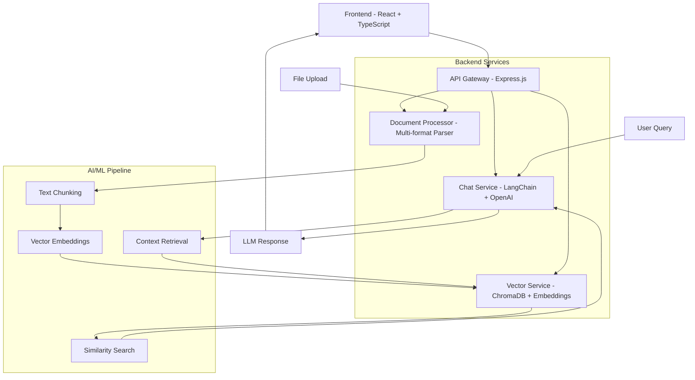

# 🤖 Advanced AI Chatbot with ML/NLP Integration

**Transform any analytics dashboard into an intelligent conversational interface with 1-click file upload and instant model training.**

[](https://opensource.org/licenses/MIT)
[](https://www.typescriptlang.org/)
[](https://reactjs.org/)
[](https://nodejs.org/)
[](https://openai.com/)

## 🚀 Features

### 🧠 Advanced AI/ML Backend
- **Vector Embeddings**: ChromaDB + OpenAI embeddings for semantic search
- **Document Processing**: Auto-parse TXT, PDF, CSV, MD, JSON, DOCX files
- **Streaming Responses**: Real-time ChatGPT-style conversation flow
- **Context Memory**: Intelligent context injection from uploaded documents
- **LangChain Integration**: Production-ready AI orchestration

### 💬 Modern Chat Interface
- **ChatGPT-style UI**: Beautiful, responsive chat interface
- **File Upload Training**: Drag & drop files for instant AI training
- **Multi-conversation**: Persistent conversation management
- **Real-time Typing**: Streaming responses with typing indicators
- **Mobile Responsive**: Optimized for all device sizes

### 🔧 Developer Experience
- **Full-Stack TypeScript**: End-to-end type safety
- **Docker Ready**: Complete containerization with docker-compose
- **API-First Design**: RESTful backend with comprehensive endpoints
- **Hot Reload**: Development server with instant updates
- **Production Ready**: Nginx, logging, monitoring, health checks

## 🏗️ Architecture



## 🛠️ Tech Stack

| Category | Frontend | Backend | AI/ML |
|----------|----------|---------|-------|
| **Framework** | React 18 | Express.js | LangChain |
| **Language** | TypeScript | Node.js | OpenAI API |
| **Styling** | Tailwind CSS | - | ChromaDB |
| **Build** | Vite | - | Vector Embeddings |
| **State** | React Hooks | - | Document Processing |

## ⚡ Quick Start

### Prerequisites
- Node.js 18+ 
- OpenAI API Key
- Docker (optional)

### 1. Clone & Install
```bash
git clone <your-repo-url>
cd advanced-ai-chatbot

# Install frontend dependencies
npm install

# Install backend dependencies
npm run install:backend
```

### 2. Environment Setup
```bash
# Copy environment files
cp .env.example .env
cp server/.env.example server/.env

# Add your OpenAI API key to server/.env
OPENAI_API_KEY=sk-your-openai-api-key-here
```

### 3. Start Development
```bash
# Start both frontend and backend
npm run dev

# Or start separately
npm run dev:frontend  # Frontend on :5173
npm run dev:backend   # Backend on :3001
```

### 4. Upload & Train
1. Open http://localhost:5173
2. Click "Training Data" → "Import Files"
3. Upload your documents (PDF, TXT, CSV, etc.)
4. Start chatting with your AI assistant!

## 🐳 Docker Deployment

### Quick Start with Docker Compose
```bash
# Set your OpenAI API key
export OPENAI_API_KEY=sk-your-key-here

# Start all services
docker-compose up -d

# View logs
docker-compose logs -f

# Stop services
docker-compose down
```

### Production Deployment
```bash
# Build production images
docker-compose -f docker-compose.yml build

# Deploy with environment file
docker-compose --env-file .env.production up -d
```

## 📁 Project Structure

```
├── src/                    # Frontend React application
│   ├── components/         # React components
│   ├── hooks/             # Custom React hooks
│   ├── services/          # API services
│   └── types/             # TypeScript definitions
├── server/                # Backend Node.js application
│   ├── src/
│   │   ├── routes/        # API endpoints
│   │   ├── services/      # Business logic
│   │   ├── middleware/    # Express middleware
│   │   └── utils/         # Utilities
│   ├── uploads/           # File upload directory
│   ├── vector_store/      # ChromaDB storage
│   └── logs/              # Application logs
├── docs/                  # Documentation
├── docker-compose.yml     # Full-stack deployment
└── README.md             # This file
```

## 🎓 Training Your AI in 3 Steps

### Method 1: File Upload (Recommended)
```bash
# 1. Upload files through UI
# Click "Training Data" → "Import Files" → Select files

# 2. Files are automatically processed
# - Text extraction and chunking
# - Vector embedding generation  
# - Storage in ChromaDB

# 3. Start chatting!
# Your AI now has context from uploaded documents
```

### Method 2: Manual Training
```bash
# Add specific input/output examples
POST /api/training
{
  "input": "What is our revenue?",
  "expectedOutput": "Based on the data, our Q4 revenue is $2.5M",
  "intent": "revenue_query"
}
```

### Method 3: Bulk Import
```bash
# Import JSON training data
POST /api/training/bulk
[
  {
    "input": "Hello",
    "expectedOutput": "Hi! How can I help you?",
    "intent": "greeting"
  }
]
```

## 🔌 API Documentation

### Chat Endpoints
```bash
# Stream chat response
POST /api/chat
{
  "message": "What is machine learning?",
  "conversationHistory": [...],
  "useContext": true
}

# Simple response
POST /api/chat/simple
{
  "message": "Hello"
}
```

### Upload Endpoints
```bash
# Upload files
POST /api/upload
Content-Type: multipart/form-data

# Upload text
POST /api/upload/text
{
  "content": "Your content here",
  "filename": "example.txt"
}
```

### Training Endpoints
```bash
# Add training data
POST /api/training
{
  "input": "question",
  "expectedOutput": "answer",
  "intent": "category"
}

# Get statistics
GET /api/training/stats
```

## 📊 Monitoring & Health

### Health Checks
```bash
# Basic health
curl http://localhost:3001/health

# Detailed status
curl http://localhost:3001/api/status

# Configuration
curl http://localhost:3001/api/status/config
```

### Logs
```bash
# Application logs
tail -f server/logs/combined.log

# Error logs
tail -f server/logs/error.log

# Docker logs
docker-compose logs -f backend
```

## 🔧 Configuration

### Frontend Environment Variables
```bash
VITE_API_URL=http://localhost:3001
VITE_ENABLE_DEBUG=false
```

### Backend Environment Variables
```bash
# Required
OPENAI_API_KEY=sk-your-key-here
OPENAI_MODEL=gpt-3.5-turbo
OPENAI_EMBEDDING_MODEL=text-embedding-ada-002

# Optional
PORT=3001
CHROMA_DB_PATH=./vector_store
UPLOAD_DIR=./uploads
MAX_FILE_SIZE=50MB
CHUNK_SIZE=1000
CHUNK_OVERLAP=200
```

## 🚀 Production Deployment

### Vercel (Frontend)
```bash
# Install Vercel CLI
npm i -g vercel

# Deploy frontend
vercel --prod
```

### Railway/Render (Backend)
```bash
# Set environment variables in dashboard
OPENAI_API_KEY=sk-your-key
NODE_ENV=production

# Deploy from GitHub repository
```

### VPS/Cloud (Full Stack)
```bash
# Clone repository
git clone <your-repo>

# Set environment variables
cp .env.example .env.production

# Deploy with Docker
docker-compose -f docker-compose.yml up -d
```

## ❓ FAQ

**Q: What file formats are supported?**
A: TXT, PDF, MD, CSV, JSON, DOCX files up to 50MB each.

**Q: How does the AI learn from documents?**
A: Files are chunked, converted to vector embeddings, and stored in ChromaDB for semantic search during conversations.

**Q: Can I use different AI models?**
A: Yes! Configure `OPENAI_MODEL` in environment variables. Supports GPT-3.5, GPT-4, and compatible APIs.

**Q: Is my data secure?**
A: All data is processed locally or in your infrastructure. No data is sent to third parties except OpenAI for embeddings/chat.

**Q: How do I scale for production?**
A: Use Docker Compose with multiple backend instances, Redis caching, and a load balancer.

## 🐛 Known Issues

- Large file uploads (>50MB) may timeout
- ChromaDB requires persistent storage for production
- OpenAI API rate limits may affect response times
- Mobile file upload may have browser limitations

## 🤝 Contributing

1. Fork the repository
2. Create a feature branch (`git checkout -b feature/amazing-feature`)
3. Commit your changes (`git commit -m 'Add amazing feature'`)
4. Push to the branch (`git push origin feature/amazing-feature`)
5. Open a Pull Request

## 📄 License

This project is licensed under the MIT License - see the [LICENSE](LICENSE) file for details.

---

**Built with ❤️ for the future of conversational AI**

🌟 **Star this repo** if you found it helpful!  
🐛 **Report issues** on GitHub  
💬 **Join discussions** in our community  
📧 **Contact us** for enterprise support