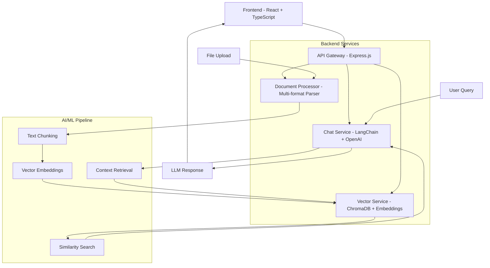

# 🤖 Advanced AI Chatbot with ML/NLP Integration

**Transform any analytics dashboard into an intelligent conversational interface with 1-click file upload and instant model training.**

[](https://opensource.org/licenses/MIT)
[](https://www.typescriptlang.org/)
[](https://reactjs.org/)
[](https://nodejs.org/)
[](https://openai.com/)

## 🚀 Features

### 🧠 Advanced AI/ML Backend
- **Vector Embeddings**: ChromaDB + OpenAI embeddings for semantic search
- **Document Processing**: Auto-parse TXT, PDF, CSV, MD, JSON, DOCX files
- **Streaming Responses**: Real-time ChatGPT-style conversation flow
- **Context Memory**: Intelligent context injection from uploaded documents
- **LangChain Integration**: Production-ready AI orchestration

### 💬 Modern Chat Interface
- **ChatGPT-style UI**: Beautiful, responsive chat interface
- **File Upload Training**: Drag & drop files for instant AI training
- **Multi-conversation**: Persistent conversation management
- **Real-time Typing**: Streaming responses with typing indicators
- **Mobile Responsive**: Optimized for all device sizes

### 🔧 Developer Experience
- **Full-Stack TypeScript**: End-to-end type safety
- **Docker Ready**: Complete containerization with docker-compose
- **API-First Design**: RESTful backend with comprehensive endpoints
- **Hot Reload**: Development server with instant updates
- **Production Ready**: Nginx, logging, monitoring, health checks

## 🏗️ Architecture



## 🛠️ Tech Stack

| Category | Frontend | Backend | AI/ML |
|----------|----------|---------|-------|
| **Framework** | React 18 | Express.js | LangChain |
| **Language** | TypeScript | Node.js | OpenAI API |
| **Styling** | Tailwind CSS | - | ChromaDB |
| **Build** | Vite | - | Vector Embeddings |
| **State** | React Hooks | - | Document Processing |

## ⚡ Quick Start

### Prerequisites
- Node.js 18+ 
- OpenAI API Key
- Docker (optional)

### 1. Clone & Install
```bash
git clone <your-repo-url>
cd advanced-ai-chatbot

# Install frontend dependencies
npm install

# Install backend dependencies
npm run install:backend
```

### 2. Environment Setup
```bash
# Copy environment files
cp .env.example .env
cp server/.env.example server/.env

# Add your OpenAI API key to server/.env
OPENAI_API_KEY=sk-your-openai-api-key
```

### 3. Start Development
```bash
# Start both frontend and backend
npm run dev

# Or start separately
npm run dev:frontend  # Frontend on :5173
npm run dev:backend   # Backend on :3001
```

### 4. Upload & Train
1. Open http://localhost:5173
2. Click "Training Data" → "Import Files"
3. Upload your documents (PDF, TXT, CSV, etc.)
4. Start chatting with your AI assistant!

## 🐳 Docker Deployment

### Quick Start with Docker Compose
```bash
# Set your OpenAI API key
export OPENAI_API_KEY=sk-your-key-here

# Start all services
docker-compose up -d

# View logs
docker-compose logs -f

# Stop services
docker-compose down
```

### Production Deployment
```bash
# Build production images
docker-compose -f docker-compose.yml build

# Deploy with environment file
docker-compose --env-file .env.production up -d
```

## 📁 Project Structure

```
├── src/                    # Frontend React application
│   ├── components/         # React components
│   ├── hooks/             # Custom React hooks
│   ├── services/          # API services
│   └── types/             # TypeScript definitions
├── server/                # Backend Node.js application
│   ├── src/
│   │   ├── routes/        # API endpoints
│   │   ├── services/      # Business logic
│   │   ├── middleware/    # Express middleware
│   │   └── utils/         # Utilities
│   ├── uploads/           # File upload directory
│   ├── vector_store/      # ChromaDB storage
│   └── logs/              # Application logs
├── docs/                  # Documentation
├── docker-compose.yml     # Full-stack deployment
└── README.md             # This file
```

## 🎓 Training Your AI in 3 Steps

### Method 1: File Upload (Recommended)
```bash
# 1. Upload files through UI
# Click "Training Data" → "Import Files" → Select files

# 2. Files are automatically processed
# - Text extraction and chunking
# - Vector embedding generation  
# - Storage in ChromaDB

# 3. Start chatting!
# Your AI now has context from uploaded documents
```

### Method 2: Manual Training
```bash
# Add specific input/output examples
POST /api/training
{
  "input": "What is our revenue?",
  "expectedOutput": "Based on the data, our Q4 revenue is $2.5M",
  "intent": "revenue_query"
}
```

### Method 3: Bulk Import
```bash
# Import JSON training data
POST /api/training/bulk
[
  {
    "input": "Hello",
    "expectedOutput": "Hi! How can I help you?",
    "intent": "greeting"
  }
]
```

## 🔌 API Documentation

### Chat Endpoints
```bash
# Stream chat response
POST /api/chat
{
  "message": "What is machine learning?",
  "conversationHistory": [...],
  "useContext": true
}

# Simple response
POST /api/chat/simple
{
  "message": "Hello"
}
```

### Upload Endpoints
```bash
# Upload files
POST /api/upload
Content-Type: multipart/form-data

# Upload text
POST /api/upload/text
{
  "content": "Your content here",
  "filename": "example.txt"
}
```

### Training Endpoints
```bash
# Add training data
POST /api/training
{
  "input": "question",
  "expectedOutput": "answer",
  "intent": "category"
}

# Get statistics
GET /api/training/stats
```

## 📊 Monitoring & Health

### Health Checks
```bash
# Basic health
curl http://localhost:3001/health

# Detailed status
curl http://localhost:3001/api/status

# Configuration
curl http://localhost:3001/api/status/config
```

### Logs
```bash
# Application logs
tail -f server/logs/combined.log

# Error logs
tail -f server/logs/error.log

# Docker logs
docker-compose logs -f backend
```

## 🔧 Configuration

### Frontend Environment Variables
```bash
VITE_API_URL=http://localhost:3001
VITE_ENABLE_DEBUG=false
```

### Backend Environment Variables
```bash
# Required
OPENAI_API_KEY=sk-your-key-here
OPENAI_MODEL=gpt-3.5-turbo
OPENAI_EMBEDDING_MODEL=text-embedding-ada-002

# Optional
PORT=3001
CHROMA_DB_PATH=./vector_store
UPLOAD_DIR=./uploads
MAX_FILE_SIZE=50MB
CHUNK_SIZE=1000
CHUNK_OVERLAP=200
```

## 🚀 Production Deployment

### Vercel (Frontend)
```bash
# Install Vercel CLI
npm i -g vercel

# Deploy frontend
vercel --prod
```

### Railway/Render (Backend)
```bash
# Set environment variables in dashboard
OPENAI_API_KEY=sk-your-key
NODE_ENV=production

# Deploy from GitHub repository
```

### VPS/Cloud (Full Stack)
```bash
# Clone repository
git clone <your-repo>

# Set environment variables
cp .env.example .env.production

# Deploy with Docker
docker-compose -f docker-compose.yml up -d
```

## 🧑‍💻 Developer Onboarding & Environment Setup

### 1. Clone the Repository
```bash
# Clone the repo
git clone <your-repo-url>
cd advanced-ai-chatbot
```

### 2. Environment Variables
- Copy the example environment files:
  ```bash
  cp .env.example .env
  cp server/.env.example server/.env
  ```
- Edit `server/.env` and set your OpenAI API key and any other required values.
- **See `server/.env.example` for a full list of required and optional variables, with comments explaining each one.**

### 3. Install Dependencies
```bash
npm install
npm run install:backend
```

### 4. Start Development
```bash
npm run dev
```

### 5. Troubleshooting
- If you see errors about missing environment variables, check your `.env` and `server/.env` files.
- For more details, see the comments in `server/.env.example`.

## ❓ FAQ

**Q: What file formats are supported?**
A: TXT, PDF, MD, CSV, JSON, DOCX files up to 50MB each.

**Q: How does the AI learn from documents?**
A: Files are chunked, converted to vector embeddings, and stored in ChromaDB for semantic search during conversations.

**Q: Can I use different AI models?**
A: Yes! Configure `OPENAI_MODEL` in environment variables. Supports GPT-3.5, GPT-4, and compatible APIs.

**Q: Is my data secure?**
A: All data is processed locally or in your infrastructure. No data is sent to third parties except OpenAI for embeddings/chat.

**Q: How do I scale for production?**
A: Use Docker Compose with multiple backend instances, Redis caching, and a load balancer.

## 🐛 Known Issues

- Large file uploads (>50MB) may timeout
- ChromaDB requires persistent storage for production
- OpenAI API rate limits may affect response times
- Mobile file upload may have browser limitations

## 🤝 Contributing

1. Fork the repository
2. Create a feature branch (`git checkout -b feature/amazing-feature`)
3. Commit your changes (`git commit -m 'Add amazing feature'`)
4. Push to the branch (`git push origin feature/amazing-feature`)
5. Open a Pull Request

## 📄 License

This project is licensed under the MIT License - see the [LICENSE](LICENSE) file for details.

---

**Built with ❤️ for the future of conversational AI**

🌟 **Star this repo** if you found it helpful!  
🐛 **Report issues** on GitHub  
💬 **Join discussions** in our community  
📧 **Contact us** for enterprise support

## ⚠️ TODOs & Further Review
- [ ] Review all documentation after major changes (API, onboarding, deployment, etc.)
- [ ] Ensure all new features and improvements are reflected in this README and in backend docs.
- [ ] Add/expand OpenAPI/Swagger docs as needed.
- [ ] Mark any ambiguous or in-progress features for further review.

## Environment Variables

All required environment variables for both frontend and backend are documented in:
- `.env.example` (frontend)
- `server/env.example` (backend)

**Do not commit secrets to the repository.**
- For local development, copy these files to `.env` and `server/.env` and fill in your real values.
- For production (Render), set all secrets and environment variables in the Render dashboard only.

### Frontend Required Variables
- `VITE_API_URL`: URL of your backend API
- `VITE_SUPABASE_URL`: Your Supabase project URL
- `VITE_SUPABASE_ANON_KEY`: Your Supabase anon key
- `VITE_ENABLE_STREAMING`, `VITE_ENABLE_CACHING`, etc.: Feature flags (optional)

### Backend Required Variables
- `PORT`, `NODE_ENV`, `CORS_ORIGIN`: Server and CORS config
- `OPENAI_API_KEY`, `OPENAI_MODEL`, `OPENAI_EMBEDDING_MODEL`, etc.: OpenAI config
- `SUPABASE_URL`, `SUPABASE_SERVICE_ROLE_KEY`: Supabase config
- `REDIS_URL`, `CACHE_TTL_SECONDS`, etc.: Redis/cache config (if used)
- `LOG_LEVEL`, `ENABLE_HELMET`, etc.: Logging and security

See the example files for the full list and descriptions.

## Render Monitoring & Alerts

### Viewing Logs
- Go to your Render dashboard.
- Select your backend service.
- Click the "Logs" tab to view real-time logs (all winston logs, errors, and Sentry events are visible).

### Setting Up Alerts
- In Render, go to the "Alerts" section of your service.
- Enable alerts for downtime, failed deploys, and high error rates.
- Optionally, set up email or Slack notifications for critical events.

# Smart Brain AI Chatbot

A full-stack AI chatbot with instant file learning capabilities using RAG (Retrieval-Augmented Generation), GPT-4, embeddings, and vector databases.

## 🚀 Features

- **Instant File Learning**: Upload documents and chat with AI that learns from them instantly
- **RAG Technology**: Advanced retrieval-augmented generation for accurate responses
- **Supabase Authentication**: Secure user authentication and session management
- **Real-time Chat**: Stream responses from AI with typing indicators
- **Document Processing**: Support for PDF, DOCX, TXT, and more
- **Vector Database**: Efficient document storage and retrieval
- **Modern UI**: Beautiful, responsive interface with dark/light themes

## 🏗️ Architecture

```
Smart Brain AI Chatbot
├── Frontend (React + Vite + TypeScript)
│   ├── Authentication (Supabase)
│   ├── Chat Interface
│   ├── File Upload
│   └── Real-time Updates
├── Backend (Node.js + Express + TypeScript)
│   ├── Smart Brain Service
│   ├── Document Processing
│   ├── Vector Database Integration
│   └── OpenAI Integration
└── Database (Supabase)
    ├── User Authentication
    ├── Document Storage
    └── Vector Embeddings
```

## 🛠️ Tech Stack

### Frontend
- **React 18** with TypeScript
- **Vite** for fast development
- **Tailwind CSS** for styling
- **Supabase JS Client** for authentication
- **React Router** for navigation
- **Lucide React** for icons

### Backend
- **Node.js** with Express
- **TypeScript** for type safety
- **Supabase** for authentication & database
- **OpenAI API** for AI capabilities
- **Vector Database** for document storage
- **JWT** for secure authentication

## 📦 Installation

### Prerequisites
- Node.js 18+ 
- npm or yarn
- Supabase account
- OpenAI API key

### 1. Clone the Repository
```bash
git clone <repository-url>
cd AI_Chatbot_2/project
```

### 2. Install Dependencies
```bash
# Install root dependencies
npm install

# Install client dependencies
cd client
npm install

# Install server dependencies
cd ../server
npm install
```

### 3. Environment Setup

#### Frontend (.env)
```bash
cd client
cp env.example .env
```

Edit `.env`:
```env
VITE_SUPABASE_URL=your_supabase_project_url
VITE_SUPABASE_ANON_KEY=your_supabase_anon_key
VITE_API_URL=http://localhost:3001
```

#### Backend (.env)
```bash
cd server
cp env.example .env
```

Edit `.env`:
```env
PORT=3001
NODE_ENV=development
CLIENT_URL=http://localhost:5173

# Supabase Configuration
SUPABASE_URL=your_supabase_project_url
SUPABASE_ANON_KEY=your_supabase_anon_key
SUPABASE_SERVICE_ROLE_KEY=your_supabase_service_role_key

# OpenAI Configuration
OPENAI_API_KEY=your_openai_api_key
```

### 4. Supabase Setup

1. Create a new Supabase project
2. Enable Email authentication in Auth settings
3. Copy your project URL and keys to environment files
4. Set up your database tables (will be done in future constraints)

### 5. Start Development Servers

#### Option 1: Individual Servers
```bash
# Start backend (from server directory)
cd server
npm run dev

# Start frontend (from client directory)
cd client
npm run dev
```

#### Option 2: Concurrent (from root)
```bash
# From project root
npm run dev
```

## 🔐 Authentication

The app uses Supabase for secure authentication:

- **Sign Up**: Email/password registration
- **Sign In**: Email/password login
- **Session Management**: Automatic token refresh
- **Protected Routes**: JWT validation on backend
- **User Context**: Global auth state management

### Authentication Flow
1. User signs up/logs in via Supabase
2. Frontend stores session token
3. Backend validates JWT tokens
4. Protected routes require authentication
5. Session persists across page reloads

## 🚀 Development

### Available Scripts

#### Root (Project Level)
```bash
npm run dev          # Start both client and server
npm run build        # Build both client and server
npm run test         # Run tests for both
npm run lint         # Lint both client and server
```

#### Client
```bash
npm run dev          # Start Vite dev server
npm run build        # Build for production
npm run preview      # Preview production build
npm run test         # Run tests
npm run lint         # Lint code
```

#### Server
```bash
npm run dev          # Start with nodemon
npm run build        # Build TypeScript
npm run start        # Start production server
npm run test         # Run tests
npm run lint         # Lint code
```

### Project Structure
```
project/
├── client/                 # Frontend React app
│   ├── src/
│   │   ├── components/    # React components
│   │   ├── context/       # React context (Auth)
│   │   ├── lib/          # Utilities (Supabase)
│   │   ├── pages/        # Page components
│   │   └── services/     # API services
│   └── public/           # Static assets
├── server/               # Backend Express app
│   ├── src/
│   │   ├── middleware/   # Express middleware
│   │   ├── routes/       # API routes
│   │   ├── services/     # Business logic
│   │   └── utils/        # Utilities
│   └── uploads/          # File uploads
└── docs/                # Documentation
```

## 🔧 Configuration

### Environment Variables

#### Frontend (.env)
- `VITE_SUPABASE_URL`: Your Supabase project URL
- `VITE_SUPABASE_ANON_KEY`: Your Supabase anonymous key
- `VITE_API_URL`: Backend API URL

#### Backend (.env)
- `PORT`: Server port (default: 3001)
- `NODE_ENV`: Environment (development/production)
- `SUPABASE_URL`: Supabase project URL
- `SUPABASE_SERVICE_ROLE_KEY`: Supabase service role key
- `OPENAI_API_KEY`: OpenAI API key

## 🧪 Testing

```bash
# Run all tests
npm run test

# Run tests with coverage
npm run test:coverage

# Run tests in watch mode
npm run test:watch
```

## 📚 API Documentation

### Authentication Endpoints
- `GET /api/auth/me` - Get current user info
- `GET /api/auth/verify` - Verify token validity
- `GET /api/auth/health` - Auth service health check

### Health Check
- `GET /api/health` - Server health status

## 🔒 Security Features

- **JWT Authentication**: Secure token-based auth
- **CORS Protection**: Configured for production
- **Helmet Security**: HTTP headers protection
- **Input Validation**: Request validation middleware
- **Rate Limiting**: API rate limiting (future)
- **File Upload Security**: Secure file handling

## 🚀 Deployment

### Frontend (Vercel/Netlify)
```bash
cd client
npm run build
# Deploy dist/ folder
```

### Backend (Railway/Render)
```bash
cd server
npm run build
npm start
```

## 📝 License

MIT License - see LICENSE file for details

## 🤝 Contributing

1. Fork the repository
2. Create a feature branch
3. Make your changes
4. Add tests
5. Submit a pull request

## 📞 Support

For support and questions:
- Create an issue in the repository
- Check the documentation
- Review the code examples

---

**Smart Brain AI Chatbot** - Powered by RAG, GPT-4, and Vector Databases