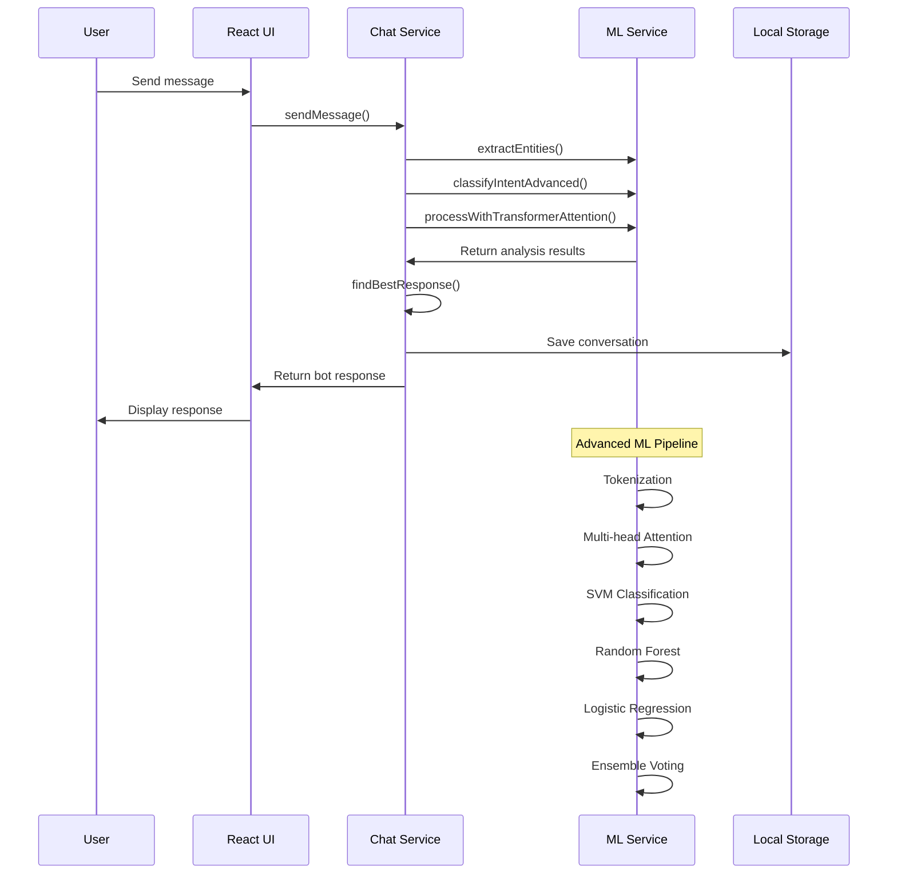

# 🏗️ System Architecture

## Frontend Structure

```
src/
├── components/           # React UI components
│   ├── ChatInput.tsx    # Message input with voice/file support
│   ├── ChatMessage.tsx  # Individual message display
│   ├── Sidebar.tsx      # Conversation management
│   ├── SettingsModal.tsx # API configuration
│   ├── TrainingModal.tsx # Model training interface
│   └── TypingIndicator.tsx # Loading animation
├── hooks/               # Custom React hooks
│   └── useChat.ts      # Chat state management
├── services/           # Business logic layer
│   ├── advancedMLService.ts # ML/NLP algorithms
│   └── chatService.ts  # Chat orchestration
├── types/              # TypeScript definitions
│   └── index.ts        # Shared interfaces
├── App.tsx             # Main application component
├── main.tsx           # React application entry
└── index.css          # Global styles
```

### Component Responsibilities

| Component | Purpose | Key Features |
|-----------|---------|--------------|
| `App.tsx` | Main layout & routing | Conversation management, modal handling |
| `ChatInput.tsx` | User input interface | Voice recording, file upload, auto-resize |
| `ChatMessage.tsx` | Message rendering | Status indicators, intent display |
| `Sidebar.tsx` | Navigation & history | Conversation list, training/settings access |
| `SettingsModal.tsx` | Configuration UI | API settings, model parameters |
| `TrainingModal.tsx` | Model training | Data import, training examples management |

## Backend Flow



## Request Processing Pipeline

### 1. Message Reception
```typescript
// User input received in ChatInput component
const handleSubmit = (message: string) => {
  onSendMessage(message.trim());
};
```

### 2. Advanced ML Processing
```typescript
// Multi-stage analysis in advancedMLService
const result = {
  entities: extractEntities(message),
  intent: classifyIntentAdvanced(message),
  embeddings: processWithTransformerAttention(message)
};
```

### 3. Response Generation
```typescript
// Intelligent response selection in chatService
const response = findBestResponse(message, {
  exactMatch: checkExactMatches(),
  mlClassification: useAdvancedML(),
  transformerSimilarity: useTransformerEmbeddings(),
  keywordMatching: useEnhancedKeywords(),
  intelligentFallback: generateAdvancedFallback()
});
```

### 4. Learning Integration
```typescript
// Continuous learning from interactions
learnFromAdvancedInteraction(message, result, context);
addHumanFeedback(input, output, reward);
```

## ML Architecture Deep Dive

### Transformer Components
- **Multi-head Attention**: 8 attention heads with 512-dimensional embeddings
- **Position Encodings**: Sinusoidal encodings for sequence understanding
- **Layer Normalization**: Stable training with gradient clipping

### Intent Classification Ensemble
1. **SVM**: Support Vector Machine with RBF kernel
2. **Random Forest**: 100 decision trees with feature bagging
3. **Logistic Regression**: L2 regularization with sigmoid activation
4. **Ensemble Voting**: Weighted combination of all classifiers

### Named Entity Recognition
- Pattern-based extraction for common entities (PERSON, ORG, LOC, DATE, TIME)
- Confidence scoring based on pattern complexity
- Context-aware entity linking

### Reinforcement Learning
- Human feedback integration with reward modeling
- Policy gradient updates for response optimization
- Experience replay for stable learning

## Scaling Considerations

### Horizontal Scaling
```yaml
# Kubernetes deployment example
apiVersion: apps/v1
kind: Deployment
metadata:
  name: ai-chatbot
spec:
  replicas: 3
  selector:
    matchLabels:
      app: ai-chatbot
  template:
    spec:
      containers:
      - name: chatbot
        image: ai-chatbot:latest
        resources:
          requests:
            memory: "512Mi"
            cpu: "250m"
          limits:
            memory: "1Gi"
            cpu: "500m"
```

### Performance Optimizations
- **Memoization**: Cache expensive ML computations
- **Lazy Loading**: Load ML models on demand
- **Web Workers**: Offload heavy computations
- **Virtual Scrolling**: Handle large conversation histories

### GPU/CPU Toggle
```typescript
// Environment-based compute selection
const useGPU = process.env.VITE_USE_GPU === 'true';
const mlConfig = {
  device: useGPU ? 'cuda' : 'cpu',
  batchSize: useGPU ? 32 : 8,
  precision: useGPU ? 'fp16' : 'fp32'
};
```

## Data Flow

### Training Data Pipeline
1. **File Upload** → Parse and validate
2. **Data Extraction** → Convert to training format
3. **Model Training** → Update ML components
4. **Validation** → Test accuracy and performance
5. **Deployment** → Activate new model weights

### Conversation Storage
```typescript
interface ConversationStorage {
  conversations: Conversation[];
  trainingData: TrainingData[];
  modelWeights: MLWeights;
  userPreferences: UserConfig;
}
```

### Memory Management
- Automatic cleanup of old conversations
- Efficient embedding storage with compression
- Garbage collection for unused ML components

## Security Architecture

### Data Protection
- All data stored locally in browser
- No external data transmission without explicit configuration
- Encryption for sensitive training data

### API Security
- API key validation and rotation
- Rate limiting for external API calls
- Request/response sanitization

### Privacy Compliance
- GDPR-compliant data handling
- User consent for data processing
- Right to data deletion